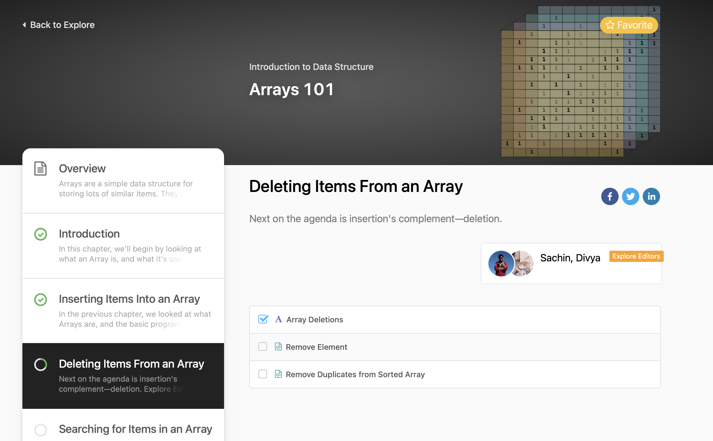

# Day 1: 2025-06-07

## ✅ What I did
- Learned about GitHub and created this repo.
- Planned my 100-day coding challenge.
- Practiced arrays
- Done LeetCode Arrays101's first 2 chapters without chatGPT!!!

## 🚧 Next Steps
- Do LeetCode Arrays101 problems.
