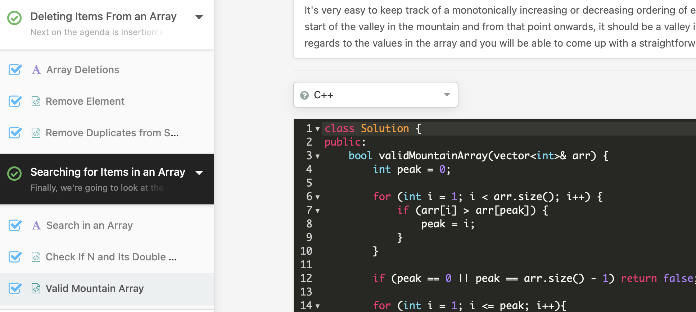

# Day 2: 2025-06-08

## ✅ What I Did
- Continued with **LeetCode Arrays 101** 🧠
- Solved 4 problems in **C++**:
  - ✅ Remove Duplicates from Sorted Array
  - ✅ Remove Element
  - ✅ Check If N and Its Double Exist
  - ✅ Valid Mountain Array
- Focused on writing cleaner, more readable code ✨

## 🔍 Key Learnings
- Understood how edge cases affect problem constraints
- Strengthened problem-solving mindset without external help

## 🚧 Next Steps
- Finish the last chapters of Arrays 101
- Brainstorm ideas for a simple CLI app (e.g., Todo list or Unit Converter)
- Push today's solutions to GitHub with clear folder structure

## 📸 Screenshot

