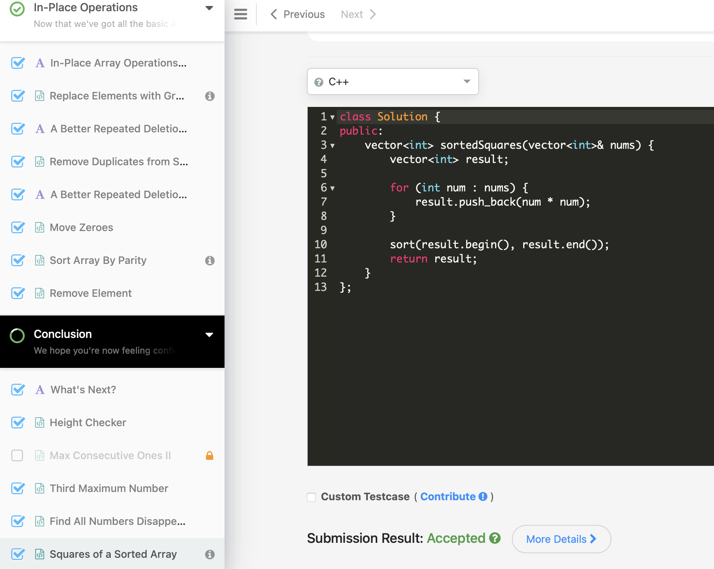

# Day 3: 2025-06-09

## ✅ What I Did
- Finished the final 2 chapters of **LeetCode Arrays 101**:
  - 🛠️ In-place Operations
  - 📌 Conclusion
- Officially completed the full Arrays 101 track! 🎉
- Solved final problems involving:
  - Shifting elements in-place
  - Array reversals and rotations

## 🔍 Key Learnings
- Mastered modifying arrays without extra space
- Understood how in-place logic reduces memory usage
- Learned to combine traversal + condition logic efficiently

## 🚧 Next Steps
- Start **LeetCode String problems**
- Begin outlining a simple Python CLI project (e.g. unit converter, task manager)
- Continue logging daily progress

## 📸 Screenshot

