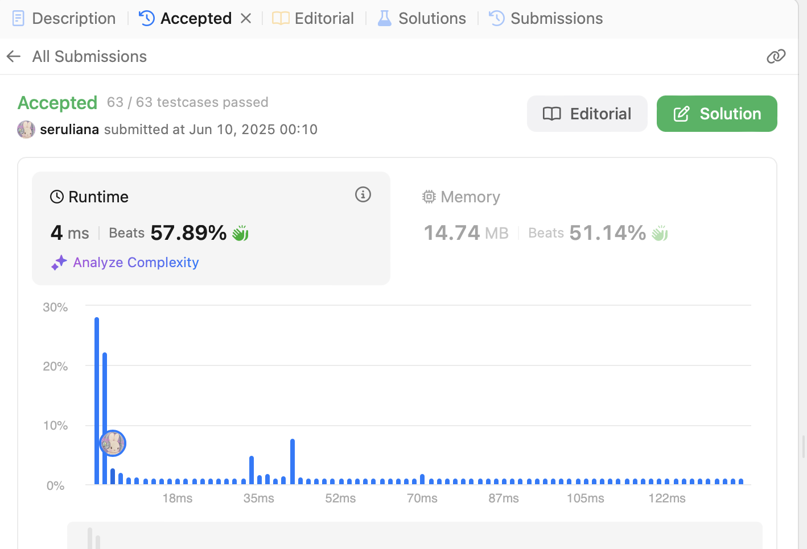

# Day 4: 2025-06-10

## ✅ What I Did
- Completed the **Two Sum** problem on LeetCode
- Spent time planning and thinking through the algorithm
- Was traveling on a rural road, so couldn’t write code

## 🚧 Challenges
- Limited coding time due to travel

## 🚀 Next Steps
- Get back to daily coding practice and LeetCode problems
- Focus on writing clean and optimized code in C++ or Python

## 📸 Screenshot

