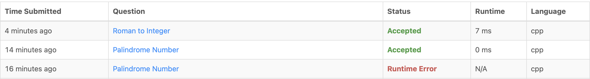

# Day 5: 2025-06-11

## ✅ What I Did
- Continued traveling but got back home later in the day
- Solved 2 LeetCode problems to stay on track:
  - Roman to Integer
  - Palindrome Number
- Committed code to GitHub in `day05/` folder

## 🚧 Challenges
- Limited time and energy due to travel

## 🚀 Next Steps
- Try 2–3 more String problems from LeetCode
- Begin outlining a small CLI app idea for Days 6–10

## 📸 Screenshot
